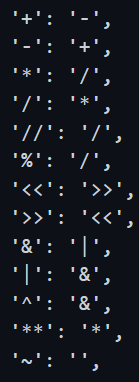
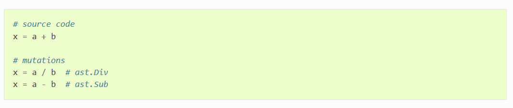
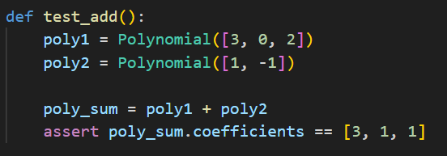
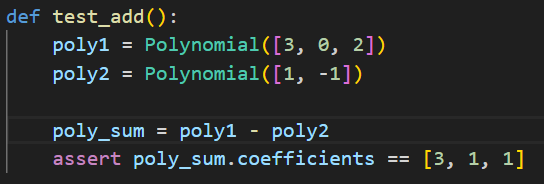
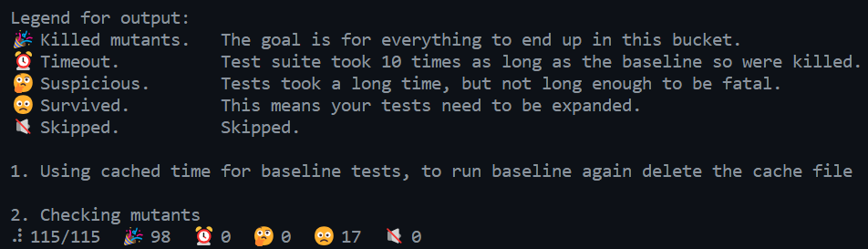
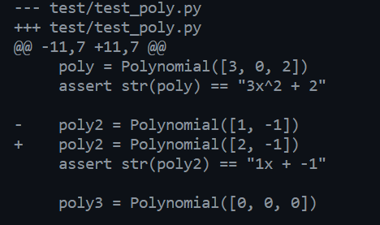
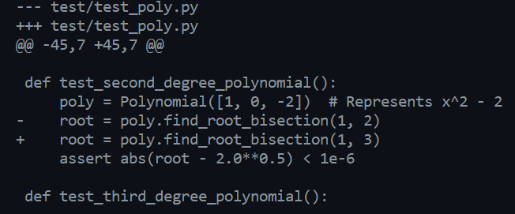
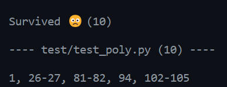

# Mutation_Testing
An application used to demonstrate mutation testing techniques. This will use the python library [mutmut](https://mutmut.readthedocs.io/en/latest/index.html) to perform mutation generation. The build file is set up in 
Github actions.

## Defining Mutation Operators
- Mutmut does most of this testing, but it is important to note that certain tests can be excluded.
- The mutation operators include examples like (- -> +) and (/ -> %) in this case. This simply means thats subtraction will be changed to addititon for example. 
- More mutations include swapping true to false and false to true, which should introduce a mutation.
- Mutatest also changes the comparison opperators. Examples include changing != to == which should also result in a mutation.
- Mutatest even provides mutation for indexs and slicing, but they will not be utalized in this application.

## Description of Applied Mutations and Impacts of the Mutations
- The implementation of this mutation file is done by Mutatest. Mutatest actually modifies the pycache file to avoid editing the source code directly. This method ensures that the mutations are not directly commited to any type of version control.
- The following is an example of how the mutation testing is done on the source code. These examples are taken from the mutmut documentation.
- 
- 
- This following example shows how it is applied to the Test_Poly source code.
- 
- 
- All of the previous examples should introduce mutations. However if the code is well written, then the mutations should be killed as soon as they appear.

## Summary of Mutant Survival and Killing

#### Console Output

## Analysis of the Test Suite Effectiveness
- It can be seen that there were quite a few mutations that ended up surving from the coverage report.
- A few mutations that survived
- 
- 
- There are a few harmless mutations that survived, Including mutations from < and <= in this case.
- There were also a few harmful ones that survived. Some examples were subtraction and addition,
as well as < and = , which could result in some serious erros.

## Recommendations for Improving the Test Suite
Improving the test suite also comes when the added draw back of adding more computation time. This is refering to if more mutations are created. This is because mutations are created exponentially, and for this reason, it is not always the best case to through this into the building process. For small applications this is completely fine. Various ways of improving this application involve directly modifying mutmut input parameters and creating custom mutations. For the most part, mutmut handles almost all mutations, but there are a few specific scenarios where new mutations parameters should be created. This is more prominent in large scale applications.

#### The Changes
There were quite a few harmless mutations, so, a simple change in the terminal command will remove some of the non problematic mutations. Some of the harmless mutations included an import statement error as well as decorator errors. This already removed 7 mutations from just applying this to the mutmut run command. The command was mutmut run --paths-to-mutate test --disable-mutation-types=decorator in this case. Now, a few of the remaining mutations were also harmless in the case that they would never happen which can allow them to removed.

- The mutations that were removed from the terminal command.  

Going further, the logic in the tests can be more clearly defined. This will remove more mutations. For example, in there is a problem with test_str that works when str(poly) != 0 and this should not be the case. Changing the logic within this test, or even creating a seperate test to handle the or statement would fix the issue here.

## Conclusion
Mutations are a very powerful software engineering design practice and can help detect problems in code earlier. They were by introducing scenarios in the code that should never work. If they do end up working, then the mutations survives, in which it is up to the developer to find the bug and fix it.
