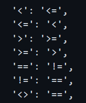

# Mutation_Testing
An application used to demonstrate mutation testing techniques. This will use the python library [Mutatest](https://mutatest.readthedocs.io/en/latest/install.html) to perform mutation generation.

### Defining Mutation Operators
- Mutatest does most of this testing, but it is important to note that certain tests can be excluded.
- The mutation operators include examples like (- -> +) and (/ -> %) in this case. This simply means thats subtraction will be changed to addititon for example. 
- More mutations include swapping true to false and false to true, which should introduce a mutation.
- Mutatest also changes the comparison opperators. Examples include changing != to == which should also result in a mutation.
- Mutatest even provides mutation for indexs and slicing, but they will not be utalized in this application.

### Description of Applied Mutations and Impacts of the Mutations
- The implementation of this mutation file is done by Mutatest. Mutatest actually modifies the pycache file to avoid editing the source code directly. This method ensures that the mutations are not directly commited to any type of version control.
- The following are examples of how the mutation testing is done on the source code. These examples are taken from the Mutatest documentation.
- 
- 
- This following example shows how it is applied to the Test_Poly source code.
- 
- 
- All of the previous examples should introduce mutations. However if the code is well written, then the mutations should be killed as soon as they appear.

### Summary of Mutant Survival and Killing

### Analysis of the Test Suite Effectiveness

### Recommendations for Improving the Test Suite

### Conclusion